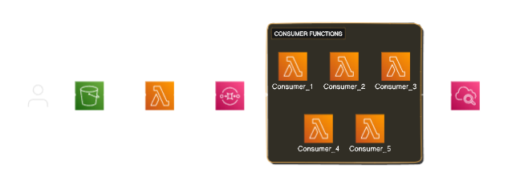
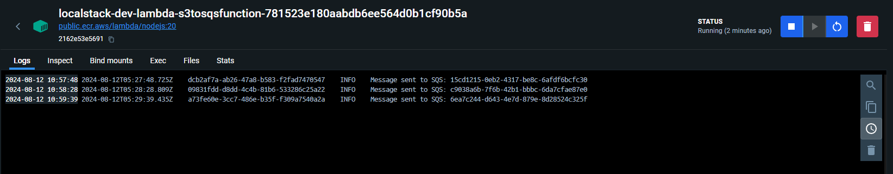
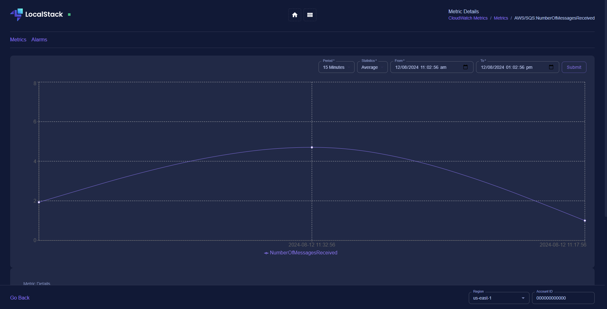
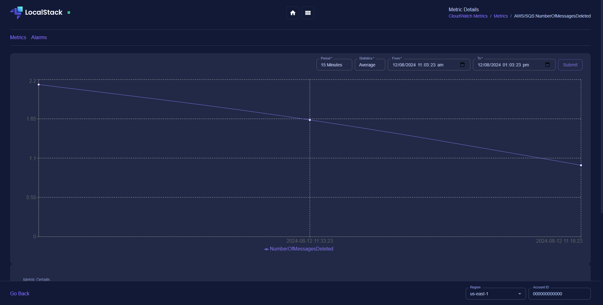

# Application Event Queue Integration with LocalStack

This guide walks you through setting up an application event queue integration using LocalStack, S3, SQS, and AWS Lambda. The goal is to create a system where objects uploaded to an S3 bucket trigger a Lambda function, which then publishes a message to an SQS queue. Another Lambda function will consume messages from this queue, process them, and send logs to CloudWatch.

## Prerequisites

- [Docker](https://www.docker.com/) installed and running
- [awscli-local (`awslocal`)](https://github.com/localstack/awscli-local) installed (`pip3 install awscli-local`)
- LocalStack Docker image (`localstack/localstack`)

## Architecture



## Setup

### Localstack environment

Run the following command to start LocalStack in a Docker container:

```bash
docker run --rm -it -p 4566:4566 -p 4571:4571 --name localstack-dev localstack/localstack
```

### Installing `awscli-local`

#### To install awscli-local, run this command:

```bash
pip3 install awscli-local
```

### Creating s3 bucket

#### Create an S3 bucket in LocalStack:

```bash
awslocal s3api create-bucket --bucket localstack-bucket
```

OR

Simply use run the command `npm run createS3Bucket`

#### Verify that the bucket was created::

```bash
awslocal s3api list-buckets
```

#### To upload objects in the s3 bucket

```bash
awslocal s3api put-object --bucket localstack-bucket --key <key_name> --body  <body>
```

#### To list the objects in the s3 bucket

```bash
awslocal s3api list-objects --bucket localstack-bucket --query 'Contents[].{Key: Key, Size: Size}'
```

### Creating localstack SQS

#### Create an SQS queue in LocalStack:

```bash
awslocal sqs create-queue --queue-name localstack-queue
```

### To list all queues

```bash
awslocal sqs list-queues
```

### Lambda function from S3 to SQS(publisher function)

#### Zipping the lambda function code:

```bash
zip function.zip index.mjs node_modules/
```

#### To create lambda function, run the command:

```bash
awslocal lambda create-function --function-name S3ToSQSFunction \
    --zip-file fileb://function.zip \
    --handler index.handler \
    --runtime nodejs20.x \
    --role arn:aws:iam::000000000000:role/lambda-role
```

### S3 bucket to trigger lambda function on object creation

```bash
awslocal s3api put-bucket-notification-configuration --bucket localstack-bucket --notification-configuration '{
    "LambdaFunctionConfigurations": [
        {
            "LambdaFunctionArn": "arn:aws:lambda:us-east-1:000000000000:function:S3ToSQSFunction",
            "Events": ["s3:ObjectCreated:*"]
        }
    ]
}'
```

### Lambda function from SQS to processing logs(consumer function)

#### Zip the processing Lambda function code:

```bash
zip function.zip index.mjs node_modules/
```


#### To create lambda function, run the command:

```bash
 awslocal lambda create-function --function-name SQSToProcessing \
    --zip-file fileb://function.zip \
    --handler index.handler \
    --runtime nodejs20.x \
    --role arn:aws:iam::000000000000:role/lambda-role
```

#### Enable X-Ray tracing for the Lambda function:

```bash
awslocal lambda update-function-configuration --function-name SQSToProcessing \
    --tracing-config Mode=Active
```

#### Set up the SQS trigger with a batch size and maximum concurrency:

```bash
awslocal lambda create-event-source-mapping --function-name SQSToProcessing \
    --event-source-arn arn:aws:sqs:us-east-1:000000000000:localstack-queue \
    --batch-size 1 --enabled
```

#### To ensure that a maximum of three Lambda functions run concurrently, set the concurrency limit:

Here we are making only 5 concurrent executions

```bash
awslocal lambda put-function-concurrency --function-name SQSToProcessing \
    --reserved-concurrent-executions 5
```

## Implementation

### Publishing messages



## Cloudwatch metrics

### Message received from SQS



### Messages deleted from SQS

